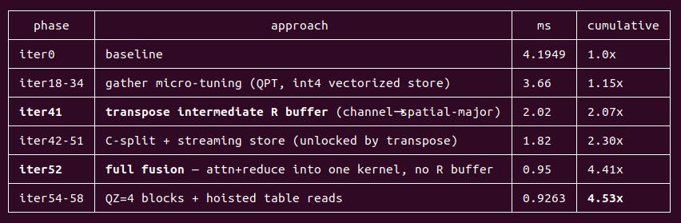
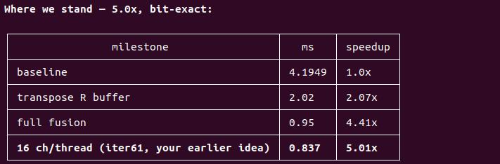

# tensorrt-plugin-autoresearch-v1    

```
├── build.sh                    # only read  
├── claude-auto.sh              # only read  
├── cmake/                      # only read  
├── CMakeLists.txt              # only read  
├── README.md                   # only read  
├── src
│   ├── utils/                  # only read
│   ├── c_api.h                 # only read  
│   ├── main.cpp                # only read  
│   ├── CMakeLists.txt          # only read, user edit before claude auto run, choose plugin instance  
|   |
│   ├── fused_sca_deform_attn        # plugin instance
│   │   ├── CMakeLists.txt           # only read  
│   │   ├── c_api.cpp                # only read, user edit before claude auto run 
│   │   ├── config.json              # only read, user edit before claude auto run 
│   │   ├── io.meta                  # only read, user edit before claude auto run 
│   │   ├── exp/                     # ai-read-write
│   │   ├── fused_sca_deform_attn.cu                  # only read  
│   │   ├── fused_sca_deform_attn.h                   # only read  
│   │   ├── fused_sca_deform_attn_plugin.cpp          # only read  
│   │   └── fused_sca_deform_attn_plugin.h            # only read 
|   |
│   ├── multiscale_deformable_attn   # plugin instance
│   │   ├── CMakeLists.txt           # only read  
│   │   ├── c_api.cpp                # only read, user edit before claude auto run 
│   │   ├── config.json              # only read, user edit before claude auto run 
│   │   ├── io.meta                  # only read, user edit before claude auto run 
│   │   ├── exp/                     # ai-read-write
│   │   ├── multiscale_deformable_attention_fp32.cu    # only read
│   │   ├── multiscale_deformable_attention.h          # only read
│   │   ├── multiscale_deformable_attention_half.cu    # only read
│   │   ├── multiscale_deformable_attention_plugin.cpp # only read
│   │   └── multiscale_deformable_attention_plugin.h   # only read
|   |
│   └── pillarvfe                    # plugin instance
│       ├── CMakeLists.txt           # only read  
│       ├── c_api.cpp                # only read, user edit before claude auto run
│       ├── config.json              # only read, user edit before claude auto run
│       ├── io.meta                  # only read, user edit before claude auto run
│       ├── input/                   # only read, real case data, user setup before claude auto run
│       ├── exp/                     # ai-read-write
│       ├── pillarVFE.cpp                              # only read
│       ├── pillarVFE.h                                # only read
│       ├── pillarVFEKernels.cu                        # only read
│       └── vfe_kernel.h                               # only read
│   
└── v1.md
```

## Quick Start

assume has install `Claude Code`   

1. start claude  
```bash
cd tensorrt-plugin-autoresearch   && bash  ./claude-auto.sh
```

2. choose a skill  
```
/trt-plugin-kernel-latency-auto-opt
```

If no error, now enter `auto-tune`   

3. output  

   

